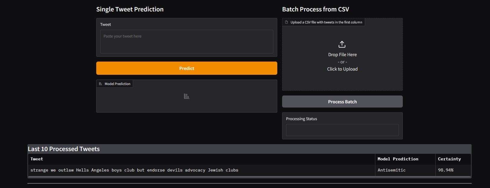

# Classifier App

A web-based application for antisemitic hate speech detection with model inference capabilities and a comprehensive evaluation framework for comparing different machine learning architectures.

## Features

- **Web GUI**: Single/batch post inference and model retraining with new data uploads
- **Model Comparison**: Unified evaluation framework across traditional ML, deep learning, and transformer models
- **Text Normalization**: Custom preprocessing to handle obfuscation and irregular patterns
- **Flexible Deployment**: CPU and GPU support for different performance requirements

## Prerequisites

- [Docker](https://www.docker.com/get-started) (required)
- GPU drivers and NVIDIA Docker runtime (optional, for GPU acceleration)

## Quick Start

Navigate to `/classifier` directory:

### Web GUI
```bash
docker-compose up webgui
```
Access the interface at `http://localhost:7860`

### Model Comparison
**CPU Mode:**
```bash
docker-compose up compare-cpu
```

**GPU Mode:**
```bash
docker-compose up compare-gpu
```
*Requires NVIDIA Docker runtime and compatible GPU*

## Tech Stack

- **ML Frameworks**: scikit-learn, Transformers, XGBoost, TensorFlow/PyTorch
- **Frontend**: Gradio
- **Deployment**: Docker

## File Structure

Core project structure:

```
classifier/src/
├── classifiers/          # Unified API wrapper classes for different model architectures
├── datasets/             # Training and test datasets
├── deep_learning_models/ # Neural network model implementations
├── normalization/        # Custom text preprocessing and normalization utilities
├── saved_models/         # Trained model files (auto-generated after training)
├── app.py                # Main web application interface
├── compare_models.py     # Model architecture comparison using classifier wrappers
├── compare_samplings.py  # Evaluation of different sampling strategies
├── model_generation.py   # Factory for initializing classifier instances by model type
└── utils.py              # Shared utility functions
```

## Usage

### Web Interface

#### Inference
- **Single Post**: Paste text directly into the input field for immediate classification. The prediction of the last 10 posts is shown below.
- **Batch Processing**: Upload CSV files with tweets in the first column for bulk analysis
- **Results**: View prediction labels, confidence scores, and processing history



#### Model Retraining and data management.
- **Dataset Management**: Upload labeled CSV files with content and sentiment columns
  - Column 1: 'content' - the text data
  - Column 2: 'sentiment' - labeled as 'Positive', 'Negative', or 'Irrelevant'
- **Add Training Data**: Integrate new labeled data into existing datasets
- **Model Training**: Retrain models with updated datasets for improved performance

> **Note**: Only CSV format is supported. Do not rename .xls, .xlsx, or .numbers to .csv - export/save as proper CSV format

### Model Comparison
- **Architecture Evaluation**: Compare traditional ML, deep learning, and transformer models
- **Sampling Strategy Analysis**: Test different data balancing techniques (oversampling, undersampling, data augmentation)
- **Performance Metrics**: Generate comprehensive reports with accuracy, precision, recall, F1-score, and confusion matrices
- **Automated Training**: Runs complete training pipeline across all model types using the unified classifier API
- **Results Export**: Save detailed comparison results and trained models for analysis
- **Resource Requirements**: Choose between CPU and GPU modes based on computational needs

### AWS Training Setup

If you're using AWS for training and use an AMI with additional instance store (SSD), the provided `mount_ssd.sh` script before building the docker image to format the temporary instance store SSD volume, and redirect Docker to use it.  
Run this script each time you start the instance.
