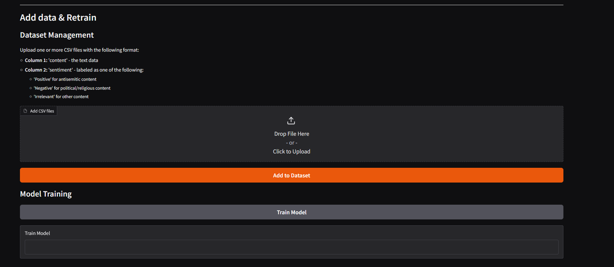

# Classifier App

A web-based application for antisemitic hate speech detection with model inference capabilities and a comprehensive evaluation framework for comparing different machine learning architectures.

## Table of Contents

1. [Features](#features)
   - [Model Comparison & Evaluation](#model-comparison--evaluation)
2. [Setup](#setup)
   - [Prerequisites](#prerequisites)
   - [AWS Setup](#aws-setup)
3. [Quick Start](#quick-start)
4. [File Structure](#file-structure)
5. [Usage](#usage)
   - [Code Usage](#code-usage)
   - [Web Interface](#web-interface)
6. [Multi-Tiered Approach](#multi-tiered-approach)

## Features

- **Web GUI**: Single/batch post inference and model retraining with new data uploads
- **Multi-Tiered Classification**: Support for creating multi-stage detection systems for granular content categorization
- **Text Normalization**: Custom preprocessing to handle obfuscation and irregular patterns
- **Flexible Deployment**: CPU and GPU support for different performance requirements

### Model Comparison & Evaluation

The system provides comprehensive model comparison capabilities:

- **Architecture Evaluation**: Compare traditional ML, deep learning, and transformer models
- **Sampling Strategy Analysis**: Test different data balancing techniques (oversampling, undersampling, data augmentation)
- **Performance Metrics**: Generate comprehensive reports with accuracy, precision, recall, F1-score, and confusion matrices
- **Automated Training**: Runs complete training pipeline across all model types using the unified classifier API
- **Results Export**: Save detailed comparison results and trained models for analysis
- **Resource Requirements**: Choose between CPU and GPU modes based on computational needs

These features can be accessed by running the comparison scripts directly using the docker-compose commands shown in the Quick Start section.

## Setup

### Prerequisites

- [Docker](https://www.docker.com/get-started) (required)
- GPU drivers and NVIDIA Docker runtime (optional, for GPU acceleration)

### AWS Setup

If you're using AWS for training and use an AMI with additional instance store (SSD), use the provided `mount_ssd.sh` script to format the temporary instance store SSD volume **before** building the docker image, and redirect Docker to use it. 

Run this script each time you start the instance. 

## Quick Start

Navigate to `/classifier` directory:

### Web GUI
```bash
docker-compose up webgui
```
Access the interface at `http://localhost:7860`

### Model Comparison & Evaluation
**CPU Mode:**
```bash
docker-compose up compare-cpu
```

**GPU Mode:**
```bash
docker-compose up compare-gpu
```
*Requires NVIDIA Docker runtime and compatible GPU*

## File Structure

Core file structure:

```
classifier/src/
├── classifiers/          # Unified API wrapper classes for different model architectures
├── datasets/             # Training and test datasets
├── deep_learning_models/ # Neural network model implementations
├── normalization/        # Custom text preprocessing and normalization utilities
├── saved_models/         # Trained model files (auto-generated after training)
├── app.py                # Main web application interface
├── compare_models.py     # Model architecture comparison using classifier wrappers
├── compare_samplings.py  # Evaluation of different sampling strategies
├── demo.py               # Complete example showing model loading, training, and prediction
├── model_generation.py   # Factory for initializing classifier instances by model type
└── utils.py              # Shared utility functions
```

## Usage

### Code Usage

For programmatic access to the classifier models, see the complete example in [`src/demo.py`](src/demo.py).

#### Model Selection
```python
use_bert = False  # Set to True for transformer model (better accuracy, higher resource usage)
                  # Set to False for classical ML model (faster, lower resource usage)
```
Which should you choose?

- BERT (use_bert=True): More accurate but requires more memory and processing power
- Classical ML (use_bert=False): Faster and lighter, good for most use cases

#### Model Loading & Errors
Loading can fail under the following conditions:
- **No saved model found**: First time running or model files were deleted
- **Docker/host compatibility issues**: Model was trained in Docker may not load outside Docker and vice versa
- **Corrupted model files**: Can occur due to insufficient RAM during previous training and saving. When running on VMs with limited resources, setting a swap file is recommended.

Regardless of the failure reason, the demo automatically regenerates and trains a new model.

#### Training Parameters

When training the model, you can adjust several settings to control how it learns:

```python
data = model.load_data(folder_name='datasets', debug=True)  # debug=True uses a small sample of test data for quick training

X_train, X_test, y_train, y_test = model.prepare_dataset(
    data, 
    augment_ratio=0.33,     # Creates additional training examples (33% found optimal)
    irrelevant_ratio=0.4,   # Includes neutral posts to improve real-world accuracy (40% found optimal)  
    balance_pct=0.5         # Controls the sensitivity vs. accuracy trade-off
)
```

**Parameter Explanations:**

- **`augment_ratio=0.33`** - Creates additional variations of antisemitic posts to help the model learn better.

- **`irrelevant_ratio=0.4`** - Includes neutral/irrelevant posts in training so the model doesn't flag everything as problematic. This makes it work better on real social media where most posts are harmless.

- **`balance_pct=0.5`** - **This is the most important setting.** It controls the trade-off between:
  - **Lower values (like 0.5)**: Catches more antisemitic content but flags more innocent posts as problematic
  - **Higher values (like 0.8)**: Fewer false positives but may miss some antisemitic content

**Real-World Usage Tips:**

- **Start conservative**: When first using the model, expect it to flag many posts as antisemitic - this is normal and safer than missing harmful content.

- **Improve over time**: Review the flagged posts and create a dataset of correctly labeled examples. Put these in the `datasets/` folder and retrain the model.

- **Gradually adjust**: As your model improves with more training data, you can increase `balance_pct` to reduce false positives.  Setting `balance_pct=None` uses all available non-antisemitic posts, which often makes the model too lenient and miss harmful content.

**Recommended workflow**: Start with default settings → Review results → Add corrected examples to training data → Retrain → Gradually increase balance_pct as accuracy improves.


#### Prediction
The models support both single text and batch prediction:
```python
# Single tweet prediction
tweet = "example tweet text"
prediction, probability = model.predict(tweet)

# Batch prediction
tweets = ["tweet 1", "tweet 2", "tweet 3"]
predictions, probabilities = model.predict(tweets)
```

See [`src/demo.py`](src/demo.py) for the complete implementation example.

### Web Interface

#### Inference
- **Single Post**: Paste text directly into the input field for immediate classification. The prediction of the last 10 posts is shown below.
- **Batch Processing**: Upload CSV files with tweets in the first column for bulk analysis
- **Results**: View prediction labels, confidence scores, and processing history


#### Model Retraining and data management
- **Dataset Management**: Upload labeled CSV files with content and sentiment columns
  - Column 1: 'content' - the text data
  - Column 2: 'sentiment' - labeled as 'Positive', 'Negative', or 'Irrelevant'
- **Add Training Data**: Integrate new labeled data into existing datasets
- **Model Training**: Retrain models with updated datasets for improved performance

> **Note**: Only CSV format is supported. Do not rename .xls, .xlsx, or .numbers to .csv - export/save as proper CSV format



## Multi-Tiered Approach

The model can be adjusted for more granular classification by creating a multi-stage detection system:

- **Stage 1**: Use the model to differentiate between antisemitic and non-antisemitic content
- **Stage 2**: Manually classify the detected antisemitic posts into subcategories to create a new dataset
- **Stage 3**: Train an additional model using the new dataset in the same way as the original model

The only adjustments required are changing the label names in the code. The output of the first model can be directly inputted into the second one.

**Advanced Multi-Layer Approach:**

It is also relatively easy to extend this tiered system to improve the current model:

1. **Pre-filtering**: Train a model to distinguish between truly irrelevant posts and politically charged content (regardless of antisemitism)
2. **Main detection**: Use only the politically charged posts to detect antisemitic posts within the politically charged ones
3. **Sub-classification**: Further categorize the antisemitic posts into specific types

This multi-layer approach is expected to drastically reduce false positives compared to direct multi-class training in our case. Each tier requires its own labeled dataset, but the initial model can effectively gather this data. After running posts through the base model and performing quick manual sorting, you can build a robust multi-layered system.

**Note**: The system can be extended to classify between more than 2 classes with minor adjustments. However, 2-class classification is recommended for the pre-filtering and main detection stages, while multi-class classification can be considered for the sub-classification stage if needed.


**Key Considerations:**

- **Manual labeling effort** is significantly reduced since each model pre-filters the data for the next stage

- **`irrelevant_ratio=0`** - Set to 0 when training models that don't need neutral content. In multi-tiered approaches, most stages classify between specific content types rather than including irrelevant posts

- **`augment_ratio`** - Still applies to whichever subcategory has fewer examples (e.g., if you have more non-violent than violent posts, augmentation helps balance the violent class)

- **`balance_pct`** - Same principle applies: lower values favor detecting more of the minority class, higher values reduce false classification between subcategories

**Example Use Cases:**
- **Violent vs Non-violent** antisemitic content
- **Direct vs Indirect** antisemitic references  
- **Historical vs Contemporary** antisemitic themes
