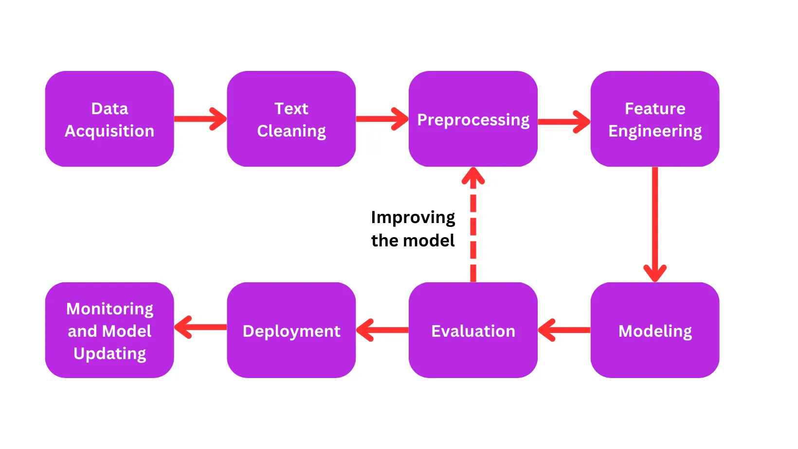

# NLP Pipeline

> temporary image, we will make our own when the structure is finalized

## Data Collection & Annotation

### Acquisition

Raw data was collected using Bright Data's web scraping tools, focusing on posts from specific users of interest. The initial set of target
users was identified by our annotation team during the first tagging phase.

We expanded our collection scope by identifying and gathering data from additional users who were mentioned in previously collected posts.

### Sanitization

We implemented a text cleaning pipeline using the **ftfy** module to repair various text encoding issues and handle corrupted content.

The process includes handling HTML entities through unescaping, fixing general text encoding problems, and resolving specific Unicode escape
sequences. Additionally, the **emoji** module was used to identify legitimate emoji characters, allowing us to preserve tweets containing
standard emojis while filtering out those with other non-ASCII characters.

Any posts containing non-ASCII characters that weren't repaired by **ftfy** or recognized as emojis were removed from the dataset to ensure
consistency.

### Annotation

A systematic human review process was placed, where annotators labeled each post according to predefined classification criteria. To
optimize data diversity, we implemented a 2/3 | 1/3 split strategy — where 2/3 of the content originated from accounts identified as
antisemitic, while the remaining 1/3 came from non-antisemitic sources. This strategic imbalance was designed based on our observation that
not all content from antisemitic accounts contains explicitly antisemitic material, ensuring a more balanced dataset.

Every post was shown to 2 different annotators. If they labeled the data differently, or if one of them expressed uncertainty, the post was
escalated to a professional for definitive tagging.

Additionally, when annotators identified a post as antisemitic, they were required to specify the antisemitic features present in the
content by selecting from a predetermined list of characteristics. While these feature annotations weren't used for model training, they
provided valuable data for our broader research objectives.

## Preprocessing Framework

Our preprocessing pipeline implements a series of text transformation operations executed in the following order:

### Linguistic Normalization

1. Obfuscation Resolution - Converting intentionally altered terms like "z1on1st" to standard forms. Altered terms were gathered during the
   anotation phase.
2. Linguistic Correction - We chose **language_tool_python**, selected for:
   - Both spelling AND grammar issues.
   - Context-aware spelling, better than simpler spell checkers.
   - Works well with informal text like social media content.

### Social Media Element Processing

- Text Normalization - Converting all text to lowercase for consistency.
- Hashtag Handling - Preserving hashtag content while removing the "#" symbol.
- User Mention Management - Replacing `@usernames` with standardized `<USER>` token.
- URL Removal - Eliminating links to focus on textual content.

#### Emoji Interpretation & Tokenization

Emoji characters can be converted into semantic text representations.

- Emojis remain as a single token because multi-word emoji descriptions are separated by underscores (i.e. "😂" →
  "emoji_face_with_tears_of_joy").
- Approach selection depends on model capabilities: some models effectively embed raw emojis as sentiment indicators, while others require
  text conversion for proper processing.

### Linguistic Structure Analysis

The linguistic analysis is performed using the **SpaCy** module for the three following steps:

1. Word tokenization - Breaking sentences into words/tokens.
2. Part-of-speech (POS) tagging - Labeling each word with its grammatical category (noun, verb, adjective, etc.) to provide context about
   word usage.
3. Stemming/Lemmatization - Reducing tokens to their root forms (eating → eat, ate → eat).

#### Additional considerations

We chose to omit both _sentence segmentation_ and _stop-word removal_ from our pipeline.

- **Sentence segmentation**: This was deemed unnecessary given the typically brief, single-sentence nature of tweets in our dataset. We
  prioritized preserving each tweet as a single cohesive unit.
- **Stop words**: We deliberately preserved these high-frequency terms as their removal can significantly distort meaning. This is
  particularly critical with negations that could invert sentiment (e.g., "not good" becoming simply "good"), which would compromise our
  analysis accuracy.
